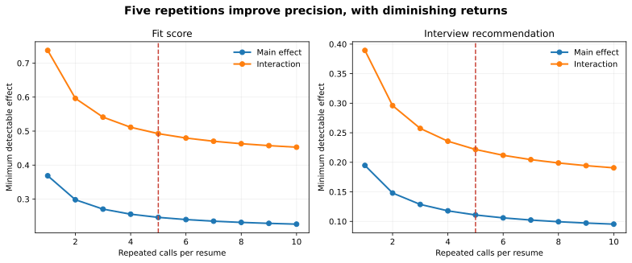

# LLM Hiring Bias Audit

A matched-résumé audit of whether a language model changes its hiring evaluation when qualifications remain fixed but a résumé reports a career gap or a non-traditional education pathway.

> **Study status:** The design and analysis pipeline are complete and mock-validated. A non-confirmatory Gemini feasibility pilot returned **18 valid screening responses across all 8 occupations; 18/18 parsed successfully and 0/18 were refusals** before the free-tier requests-per-day quota became binding. **No live Claude response has been collected or analyzed.** The next stage is a prospectively code-locked 640-evaluation audit on `claude-sonnet-4-6`. The repository does not yet claim substantive evidence of bias in a deployed model.

## Research question

Does a résumé-screening language model respond differently to otherwise equivalent candidates when a résumé reports:

1. a 12-month career gap;
2. a non-traditional education pathway;
3. either signal in a frontline rather than knowledge-work occupation?

The estimand is the change in a model's structured screening output caused by a controlled résumé signal. It is not an estimate of employer behavior, applicant outcomes, intent, or unlawful discrimination.

## Research program

Version 2 extends Version 1. Both designs and their full history remain in the repository.

| Version | Scope | Current status |
|---|---|---|
| **Version 1: original audit framework** | Core career-gap and education audit, plus a gated perceived-name-signal extension | Pipeline validated; name extension blocked by its failed pretest |
| **Version 2: robustness extension** | Power analysis, treatment-balance tests, prompt replications, manipulation checks, effect sizes, and stronger run controls | Design complete and preserved; current live execution proceeds through the additive Claude code-locked extension |

### Version 1: original framework

Version 1 established the résumé generator, matched experimental design, randomized execution, provider interface, structured parser, failure retention, fixed-effects analysis, and deterministic placebo tests.

It contains two related tracks:

- **Core study:** 32 matched profiles, 128 résumés, and 640 planned model evaluations.
- **Perceived-name-signal extension:** 512 résumés and 2,560 planned evaluations across four name-signal groups.

The name-signal extension has not run. Its first human pretest included 150 respondents and 1,200 complete ratings. The stimuli failed the locked balance rules for familiarity, perceived socioeconomic status, and unusualness. Consent and attention-check fields were also absent. The thresholds were not relaxed after the data were reviewed.

Version 1 files remain available in [`config/audit.yaml`](config/audit.yaml), [`docs/preregistration.md`](docs/preregistration.md), and [`docs/deviations_from_preregistration.md`](docs/deviations_from_preregistration.md).

### Version 2: robustness extension

Version 2 retains the Version 1 core estimand and adds the following prospective safeguards before any live Anthropic observation:

- scenario-based power analysis for the actual 640-evaluation design;
- exact treatment-wording documentation and automated résumé balance tests;
- an occupation-selection rationale using wages, education, employment scale, and observed AI exposure;
- one pre-specified primary prompt and two prompt-robustness replications;
- a separate post-primary manipulation check;
- standardized effects, confidence intervals, and recommendation probability changes;
- repeated-call variance, failure, and refusal reporting;
- a blinded human-benchmark protocol and a later model-snapshot replication protocol;
- overwrite protection, design hashes, and guarded live-run workflows.

These changes were made before any live Anthropic output was observed.

## Live execution extension

The existing Version 1 and Version 2 materials remain preserved. A separate execution layer handles live-model evidence without overwriting historical validation artifacts.

### Gemini feasibility pilot: complete

The Gemini stage was an operational check only. Using `gemini-3.6-flash`, the project preserved **18 valid outputs across all eight occupations**, with **100% parser success among returned outputs** and **0 refusals**. The free-tier requests-per-day quota prevented completion of the originally scheduled 32 calls.

The pilot is explicitly **non-confirmatory**. Its screening outcomes are not used to revise the hypotheses, résumés, occupations, sample size, prompts, Claude model, stopping rule, or statistical specification.

Full operational record: [`docs/gemini_pilot_summary.md`](docs/gemini_pilot_summary.md).

### Claude confirmatory audit: next

The confirmatory live stage is locked to:

- provider/model: **Anthropic Claude Sonnet 4.6 (`claude-sonnet-4-6`)**;
- 128 synthetic résumés;
- 5 evaluations per résumé;
- **640 primary evaluations**;
- primary prompt `v2.0-primary`;
- temperature `0.0`;
- randomized execution order;
- no selective reruns of observed model outputs.

Before the first Claude request, the runner creates `docs/claude_confirmatory_design_lock.json`, a SHA-256 manifest of the confirmatory design, prompts, provider implementation, analysis code, execution scripts, and résumé templates. This execution is therefore described as **prospectively code-locked**, not externally preregistered.

Protocol: [`docs/claude_confirmatory_protocol.md`](docs/claude_confirmatory_protocol.md).

## Experimental design

| Design element | Specification |
|---|---|
| Occupational sample | Eight purposively selected occupations: four frontline or operational and four knowledge-work roles |
| Base profiles | Four profiles per occupation, yielding 32 matched sets |
| Career-gap treatment | No stated gap versus a standardized 12-month gap |
| Education treatment | Traditional versus standardized non-traditional pathway |
| Unique résumés | 128 in the core study |
| Repeated evaluations | Five calls per résumé |
| Confirmatory sample | 640 model evaluations |
| Primary outcomes | Fit score, interview recommendation, and model confidence |
| Claude configuration | `claude-sonnet-4-6`, primary prompt `v2.0-primary`, temperature 0.0 |

Each matched profile produces four résumé variants:

| | Traditional education | Non-traditional education |
|---|---:|---:|
| No career gap | Control | Education treatment |
| 12-month career gap | Gap treatment | Combined treatment |

Within a matched set, the candidate name, target role, experience, skills, achievements, employer history, credential level, field, formatting, and non-treatment text remain fixed.

## Occupational sample

| Frontline or operational | Knowledge work |
|---|---|
| Production supervisors | Management analysts |
| Registered nurses | Project management specialists |
| Maintenance workers | Computer systems analysts |
| Logisticians | Financial analysts |

The sample is designed to create occupational contrast, not population representativeness. It spans median annual wages of roughly $49,600 to $105,900, multiple education pathways, and observed AI exposure from zero to 0.572. The complete rationale and sources are in [`docs/occupation_selection.md`](docs/occupation_selection.md).

## Statistical analysis

For outcome `Y`, the pre-specified linear specification is:

```text
Y = β1(non-traditional education)
  + β2(career gap)
  + β3(non-traditional education × frontline)
  + β4(career gap × frontline)
  + occupation fixed effects
  + matched-set fixed effects
  + temperature fixed effects
  + error
```

- Fit score and confidence use linear models.
- Interview recommendation uses a linear probability model for percentage-point interpretation.
- Logistic regression is a robustness check when the outcome has sufficient variation.
- Standard errors are clustered by `matched_set_id`, the independent matched-profile unit.
- Benjamini-Hochberg correction covers 12 confirmatory tests: four terms across three primary outcomes.
- Results report point estimates, clustered standard errors, 95% confidence intervals, standardized effects, raw p-values, adjusted q-values, and recommendation probability changes.
- Every failed request, refusal, parser error, and raw response remains in the audit record. Selective reruns are prohibited.

Occupation-specific estimates are descriptive. The study is not powered for a large set of occupation-level hypothesis tests.

## Power analysis

The pre-run calculation separates treatment-cell variation from repeated-call noise and uses a two-sided t-test approximation with 32 independent matched profiles.

| Contrast | Fit-score MDE | Recommendation-probability MDE |
|---|---:|---:|
| Main effect | 0.25 points | 0.11 |
| Frontline interaction | 0.49 points | 0.22 |

These are 80% power minimum detectable effects under stated planning assumptions. They are not observed variance estimates. The design has reasonable power for moderate main effects but limited power for subtle occupational interactions.



Assumptions and calculations: [`docs/power_analysis.md`](docs/power_analysis.md).

## Treatment validity and robustness

### Résumé balance

All 32 matched sets pass the deterministic pre-run checks for:

- word and sentence counts;
- skills count and years of experience;
- quantified-achievement count;
- the SHA-256 hash of all non-treatment text.

The exact treatment text is in [`docs/treatment_construction.md`](docs/treatment_construction.md). The generated balance report is in [`results/design/resume_balance_report.md`](results/design/resume_balance_report.md).

### Manipulation check

After the 640 primary observations are attempted, a separate factual prompt asks the same model to identify the stated career-gap duration and education pathway. This distinguishes a substantive null result from a case in which the model did not register the treatment.

### Prompt robustness

The primary prompt is `v2.0-primary`. Two post-primary replications, `v2.0-concise` and `v2.0-rubric`, reuse the same résumés, exact model ID, temperature, response schema, and five-call stopping rule. They are robustness analyses and cannot replace the primary estimate.

## Pipeline validation

The deterministic mock provider tests generation, randomization, parsing, repeated calls, model fitting, and reporting. It completed 640 of 640 core evaluations with no failures or refusals and recovered the planted fit-score effects exactly.

| Term | Planted effect | Recovered effect |
|---|---:|---:|
| 12-month career gap | -0.450 | -0.450 |
| Non-traditional education | -0.150 | -0.150 |
| Career gap × frontline | 0.000 | 0.000 |
| Education pathway × frontline | 0.000 | 0.000 |

The mock recommendation outcome is constant, so the recommendation model is reported as not estimable. These results validate the software and estimator only. They are not findings about a language model, employer, or applicant.

Validation report: [`results/core_placebo/core_placebo_validation_report.md`](results/core_placebo/core_placebo_validation_report.md).

## Prospective design lock and historical preregistration materials

The current Claude execution does **not** require OSF or AsPredicted registration. Instead, `scripts/lock_claude_confirmatory.py` creates a prospective SHA-256 design lock immediately before the first Claude request. The workflow also fixes the exact Claude model ID and refuses to overwrite existing live outputs.

Earlier OSF-ready and AsPredicted-ready files remain in the repository as historical Version 1/Version 2 research artifacts. They have not been deleted or rewritten to imply that an external preregistration occurred.

Current files:

- [`docs/claude_confirmatory_protocol.md`](docs/claude_confirmatory_protocol.md)
- `docs/claude_confirmatory_design_lock.json` — created at execution time
- [`config/claude_confirmatory.yaml`](config/claude_confirmatory.yaml)
- [`scripts/run_claude_confirmatory.sh`](scripts/run_claude_confirmatory.sh)

Historical preregistration-ready files remain under `docs/`, including `docs/osf_preregistration.md`, `docs/aspredicted_preregistration.md`, and `docs/preregistration_lock.json`.

## Reproducibility

### Validate the design without live API calls

```bash
python -m venv .venv
source .venv/bin/activate
pip install -e ".[dev]"
make v2-validate
```

This runs the power analysis, résumé balance audit, 640-evaluation mock pipeline, 128 manipulation-check tests, and automated test suite.

### Run the current Claude confirmatory program

```bash
pip install -e ".[api,dev]"
export ANTHROPIC_API_KEY="set-securely-outside-git"
export ANTHROPIC_MODEL="claude-sonnet-4-6"
bash scripts/run_claude_confirmatory.sh
```

The script creates the prospective design lock before the first Claude request, runs the 640 primary evaluations, then runs the manipulation check and two prompt replications. It preserves every attempted result and refuses to overwrite existing live output.

A guarded manual GitHub Actions workflow is also included. Store `ANTHROPIC_API_KEY` as a repository secret, then use **Actions > Claude confirmatory live audit** and type `RUN_CLAUDE`.

The older **Live audit** workflow remains in the repository as the historical Version 2 OSF-gated path. It is not the current Claude execution route.

## Interpretation and limitations

This audit can estimate whether controlled résumé signals change one model's outputs under one fixed configuration. It cannot establish:

- effects on real applicants or hiring decisions;
- employer discrimination or legal liability;
- model intent;
- demographic identity from a person's name;
- representativeness across occupations, models, prompts, providers, dates, or deployment settings.

The eight occupations form a purposive contrast sample. Synthetic résumés simplify real application materials. Repeated calls measure instability within the locked setup, not across deployment environments. Explanations generated by the model are secondary outcomes.

Full limitations: [`docs/limitations.md`](docs/limitations.md).

## Planned extensions

- collect a successful independent name-perception pretest before any name-signal audit;
- compare model and blinded human evaluations using [`docs/human_baseline_protocol.md`](docs/human_baseline_protocol.md);
- replicate the locked design on a later model snapshot using [`docs/model_replication_protocol.md`](docs/model_replication_protocol.md).

These extensions are separate studies and will not be folded into the Claude confirmatory result after outcomes are observed.

## Repository map

| Path | Purpose |
|---|---|
| [`config/`](config/) | Locked study configurations |
| [`data/templates/`](data/templates/) | Synthetic base résumé templates |
| [`data/occupations/`](data/occupations/) | Occupation registry and exposure snapshot |
| [`src/compas_audit/`](src/compas_audit/) | Generation, execution, validation, and analysis code |
| [`scripts/`](scripts/) | Reproduction, power, robustness, and live-run entry points |
| [`docs/`](docs/) | Methods, ethics, pilot records, protocols, and historical preregistration-ready materials |
| [`results/`](results/) | Committed design and mock-validation outputs |

## Citation

See [`CITATION.cff`](CITATION.cff), or:

```bibtex
@misc{nandhakumar2026audit,
  author = {Nandhakumar, Sriramkrishnan},
  title  = {LLM Hiring Bias Audit},
  year   = {2026},
  url    = {https://github.com/raamnandhakumar-eng/llm-hiring-bias-audit}
}
```

MIT licensed. Contact: Sriramkrishnan “Raam” Nandhakumar, raam.nandhakumar@gmail.com.

The public project and Python distribution are named `llm-hiring-bias-audit`. The internal import namespace remains `compas_audit` to preserve compatibility with validated historical scripts.

---

## Results addendum — 20 August 2026

This section is intentionally additive. Earlier status text above is preserved as part of the project's chronological research record and reflects the state of the study before the Claude confirmatory execution completed.

### Claude Sonnet 4.6 confirmatory execution

The prospectively code-locked Claude program completed successfully on `claude-sonnet-4-6`.

- **Primary run:** 640/640 screening evaluations completed successfully across 128 résumés, 32 matched profiles, and 8 occupations.
- **Manipulation checks:** 128/128 valid rows correctly recovered the career-gap treatment, 128/128 correctly recovered the education-pathway treatment, and 128/128 correctly recovered both jointly.
- **Prompt robustness:** the `v2.0-concise` and `v2.0-rubric` replications each completed 640/640 evaluations.
- **Total Claude screening evaluations:** 1,920/1,920 successful calls across the primary and two robustness prompts.
- The full workflow artifact and prospective design lock were preserved after execution.

### Primary empirical finding

The clearest confirmatory result is a negative effect of a **12-month career gap** on Claude's fit-score evaluation of otherwise matched résumés.

| Fit-score contrast | Estimate | 95% CI | p-value | Standardized effect |
|---|---:|---:|---:|---:|
| Career gap, knowledge-work roles | **-0.338** | **[-0.523, -0.152]** | **0.00081** | **-0.70 SD** |
| Career gap, frontline roles | **-0.225** | **[-0.383, -0.067]** | **0.0067** | **-0.47 SD** |

The career-gap × frontline interaction was **not statistically significant**. The evidence therefore supports a career-gap penalty across the sampled occupational contexts, but not a claim that the penalty is reliably larger in frontline than in knowledge-work occupations.

Claude's reported confidence also fell for résumés containing a career gap: approximately **-0.0199** in knowledge-work roles (`p = 0.00037`) and **-0.0146** in frontline roles (`p = 0.0016`).

### Education-pathway result

The non-traditional-education estimates were smaller and less robust than the career-gap result. The primary fit-score estimates were approximately **-0.113** in knowledge-work roles (`p = 0.055`) and **-0.150** in frontline roles (`p = 0.0158`). The occupation-group interaction was not statistically significant, and the main education-pathway evidence does not support the same strength of conclusion as the career-gap finding after the study's multiple-testing framework is considered.

### Prompt robustness and interpretation

The career-gap result persisted under the two pre-specified alternative prompt formulations, `v2.0-concise` and `v2.0-rubric`. These replications strengthen the interpretation that the primary career-gap finding is not an artifact of a single prompt wording.

The recommendation outcome was not estimable in this execution because it lacked sufficient variation. The strongest empirical evidence therefore concerns **fit score and model confidence**, not observed employer decisions or real-world hiring probabilities.

These findings remain bounded by the original study limitations: they describe one model snapshot under a controlled synthetic-résumé experiment. They do not establish model intent, employer discrimination, legal liability, or effects on real applicants.